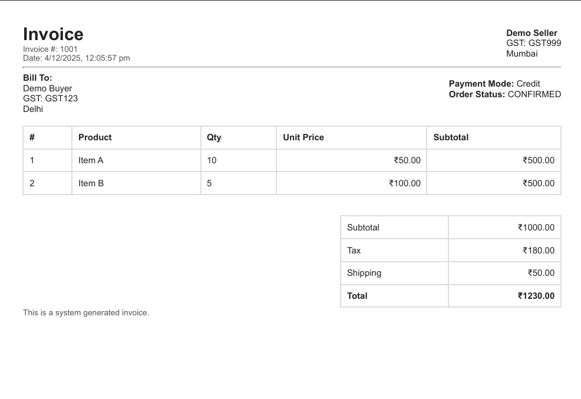

# 🚀 Wholesale / Bulk Order Management System – Backend (Member 4: Database & Invoice Module)

This repository contains the **Database Layer + Invoice Automation System** for the Wholesale/Bulk Order Management Platform.  
This module is developed by **Member 4** and is responsible for:

✅ MySQL Database Schema  
✅ Table Creation Automation  
✅ Invoice PDF Generation (Puppeteer)  
✅ Backend Integration Support  
✅ Developer-ready setup for the full project team  

---

# 🌟 Project Highlights

### 🔹 Complete MySQL Schema for B2B Commerce
- Users (Retailers & Sellers)
- Products
- Tier Pricing (Bulk Discounts)
- Credit Accounts
- Orders
- Order Items

### 🔹 Automated PDF Invoice Generation  
Fully formatted invoices with:
- Buyer & Seller info  
- GST details  
- Items table  
- Tax, shipping, totals  
- Clean, professional layout  

---

# 🖼 Sample Generated Invoice (Preview)

Below is an actual invoice generated by the system:



> *(Place `invoice_sample.png` next to README.md in your repo for this image to render properly.)*

---

# 🗂 Folder Structure

```
backend/
│
├── config/
│   └── db.js
│
├── models/
│   ├── User.js
│   ├── Product.js
│   ├── TierPricing.js
│   ├── CreditAccount.js
│   ├── Order.js
│   └── OrderItem.js
│
├── services/
│   └── invoiceGenerator.js
│
├── setup/
│   └── initDatabase.js
│
├── invoices/
│   └── (auto-generated PDF invoices)
│
├── testInvoice.js
└── app.js
```

---

# ⚙️ Environment Setup

Create a `.env` file inside `backend/`:

```
DB_HOST=localhost
DB_USER=root
DB_PASSWORD=1234
DB_NAME=bulk_order
```

> ⚠️ **Important:** Each team member must create their own `.env` locally.

---

# 📥 Install Dependencies

```
npm install mysql2 puppeteer dotenv
```

---

# 🛢 Set Up Database

## 1️⃣ Open MySQL

```
mysql -u root -p
```

## 2️⃣ Create Database

```sql
CREATE DATABASE bulk_order;
```

---

# 🛠 Initialize Tables

Run this once:

```
node setup/initDatabase.js
```

Expected output:

```
→ users table OK
→ products table OK
→ tier_pricing table OK
→ credit_accounts table OK
→ orders table OK
→ order_items table OK
✅ All tables created successfully.
```

---

# 🧾 Generate Sample Invoice

Run:

```
node testInvoice.js
```

A PDF will appear inside:

```
backend/invoices/
```

---

# 🔗 Integration Guide (For Backend Team)

### Query Example

```js
const pool = require("../config/db");
const [rows] = await pool.query("SELECT * FROM products");
```

### Generate Invoice After Order Placement

```js
const { generateInvoice } = require("../services/invoiceGenerator");
await generateInvoice(orderData);
```

---

# 🧩 Team Collaboration Guide

### Member 3 (Backend Lead)
- Build APIs using the tables created here.
- Use `pool.query()` for all CRUD.
- Call `generateInvoice()` after order creation.

### Members 1 & 2 (Frontends)
- Consume APIs built by Member 3.
- Do NOT touch database or server-side invoice code.

### Member 5 (QA & DevOps)
- Validate workflow
- Test invoice generation
- Prepare deployment

---

# 🎯 Member 4 Deliverables (Completed)

✔ Database Schema (6 tables)  
✔ MySQL Integration  
✔ DB Setup Script  
✔ Invoice Generator (Puppeteer)  
✔ Test Invoice Script  
✔ Folder Structure Setup  
✔ Team Integration Documentation  
✔ Ready-to-deploy backend module  

---

# 🏁 Final Notes

This module is **production-ready** and can be easily integrated with:

- Render  
- Railway  
- AWS MySQL (RDS)  
- PlanetScale  
- Vercel + External DB  

Just swap `.env` values when deploying.

---

# 👨‍💻 Author  
**Member 4 – Database & Invoice Specialist**  
Wholesale / Bulk Order Management System  
2025

